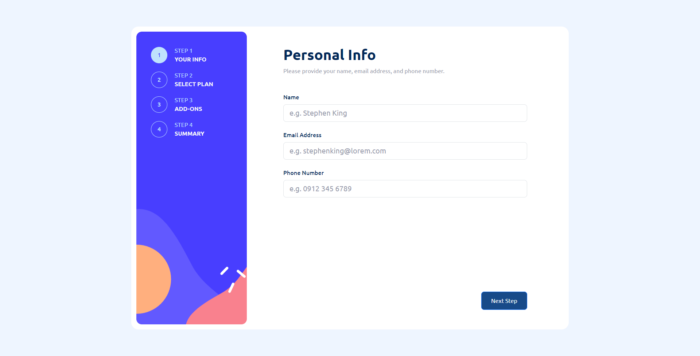
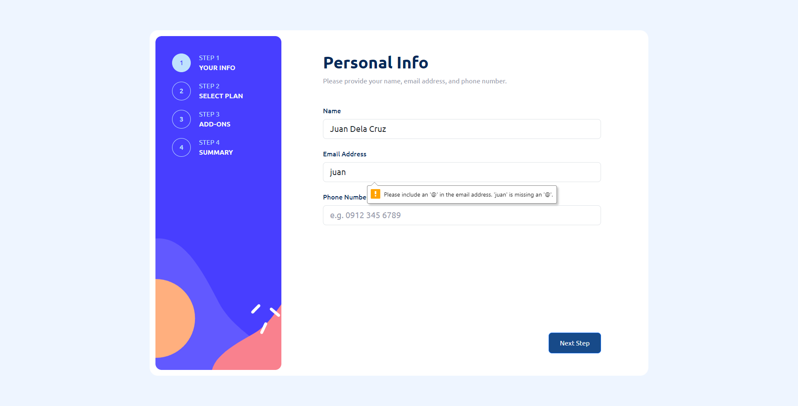
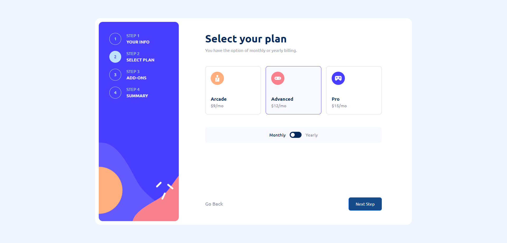
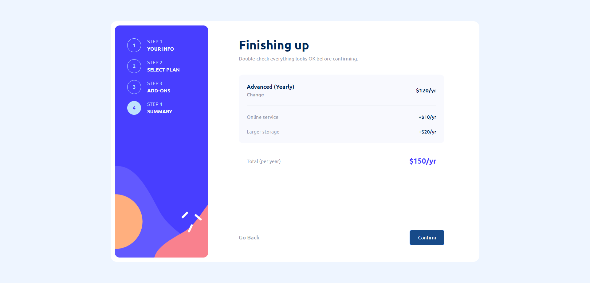
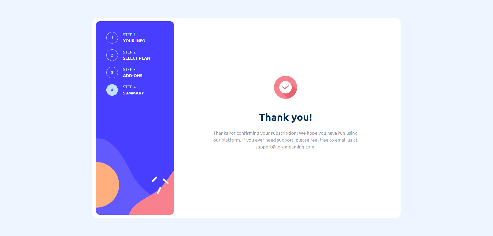
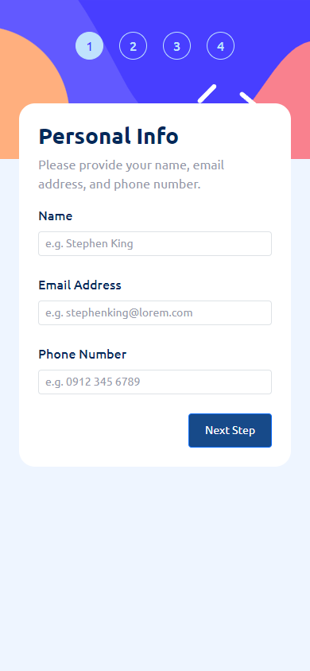

# Frontend Mentor - Multi-step form solution

This is a solution to the [Multi-step form challenge on Frontend Mentor](https://www.frontendmentor.io/challenges/multistep-form-YVAnSdqQBJ). Frontend Mentor challenges help you improve your coding skills by building realistic projects. 

## Table of contents

- [Overview](#overview)
  - [The challenge](#the-challenge)
  - [Screenshot](#screenshot)
  - [Links](#links)
- [My process](#my-process)
  - [Built with](#built-with)
  - [What I learned](#what-i-learned)
- [Author](#author)

**Note: Delete this note and update the table of contents based on what sections you keep.**

## Overview

### The challenge

Users should be able to:

- Complete each step of the sequence
- Go back to a previous step to update their selections
- See a summary of their selections on the final step and confirm their order
- View the optimal layout for the interface depending on their device's screen size
- See hover and focus states for all interactive elements on the page
- Receive form validation messages if:
  - A field has been missed
  - The email address is not formatted correctly
  - A step is submitted, but no selection has been made

### Screenshot














### Links

- Live Site URL: [Add live site URL here](https://multi-step-form-black-rho.vercel.app/)

## My process

### Built with

- [React](https://reactjs.org/) - JS library
- CSS
- Bootstrap
- React-Bootstrap
- React Hooks (useState, useEffect, useContext)
- React Router


### What I learned

Incorporating React Context in my Multi-step-form project taught me the efficiency of sharing state between components without prop drilling. It simplified data management, enhanced code readability, and eliminated the need for complex state management libraries. React Context proved to be a powerful tool, streamlining the development process and improving the project's overall structure and scalability.

To see how you can add code snippets, see below:

```js
export const FormContext = createContext();
```

```js
export const FormProvider = ({ children }) => {
    return (
        <FormContext.Provider value={{ values, setValues, isMobile }}>
            {children}
        </FormContext.Provider>
    );
}
```

```js
const { values, setValues, isMobile } = useContext(FormContext);
```

## Author

- Frontend Mentor - [@yourusername](https://www.frontendmentor.io/profile/jpentinio)
